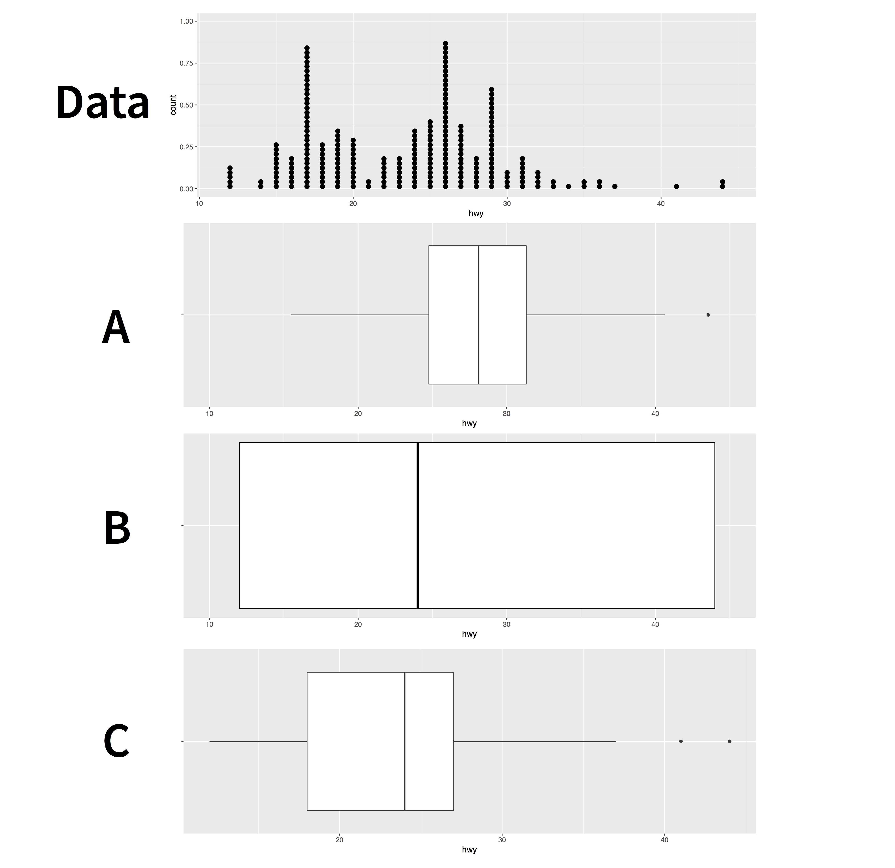

```{r setup, include=FALSE}
library(learnr)
library(tidyverse)
library(ggrepel)

checker <- function(label, user_code, check_code, envir_result, evaluate_result, ...) {
  list(message = check_code, correct = TRUE, location = "append")
}
tutorial_options(exercise.timelimit = 60, exercise.checker = checker)
knitr::opts_chunk$set(error = TRUE, out.width = "100%")
```

## Welcome

In this tutorial, our objective is to use R for exploring numerical data. Histograms are a popular way to visualize the distribution of such data. Here, we will examine histograms and their variations. You will learn how to:


* Make and interpret histograms
* Adjust the **binwidth** of a histogram to reveal new information
* Use geoms that are similar to histograms, such as __dotplots__, __frequency polygons__, and __densities__


Another way to visualize the distribution of a numeric variable is a boxplot. They can also be used to display the relationship between a continuous variable and a categorical variable. 
In this tutorial, you will further learn how to:

* Make and interpret boxplots
* Rotate boxplots by flipping the coordinate system of your plot
* Use *violin* plots and *dotplots*, two geoms that are similar to boxplots
* Make and interpret count plots

The tutorial is adapted from _R for Data Science_ by Hadley Wickham and Garrett Grolemund, published by O’Reilly Media, Inc., 2016, ISBN: 9781491910399. You can purchase the book at [shop.oreilly.com](http://shop.oreilly.com/product/0636920034407.do).

The tutorial uses the ggplot2 and dplyr packages, which have been pre-loaded for your convenience.

## Histograms

### Introduction


### How to make a histogram

To make a histogram with ggplot2, add `geom_histogram()` to the `ggplot()`. For example, the code below plots a histogram of the `carat` variable in the `diamonds` dataset, which comes with ggplot2. 

```{r hist1, exercise = TRUE, out.width = "80%", message = FALSE}
ggplot(data = diamonds) +
  geom_histogram(mapping = aes(x = carat))
```

### The y variable

As with `geom_bar()`, you do not need to give `geom_histogram()` a $y$ variable. `geom_histogram()` will construct its own $y$ variable by counting the number of observations that fall into each bin on the $x$ axis. `geom_histogram()` will then map the counts to the $y$ axis. 

```{r out.width = "80%", echo = FALSE, message = FALSE}
ggplot(data = diamonds) +
  geom_histogram(mapping = aes(x = carat))
```

By observing a bar, you can quickly see how many observations fall into a bin. Taller bars indicate more frequent values of the $x$ variable.

### Exercise 1 - Interpretation

```{r out.width = "80%", echo = FALSE, message = FALSE}
ggplot(data = diamonds) +
  geom_histogram(mapping = aes(x = carat))
```

```{r r1, echo = FALSE}
question("According to the chart, which is the most common carat size in the data?",
         answer("Approximately 0.3 or 0.4 carats", correct = TRUE, message = "More than 15,000 diamonds in the dataset have a value in the bin near 0.3 and 0.4. That's more than any other bin. How do we know? Because the bar above 0.3 to 0.4 goes to 15,000, higher than any other bar in the plot."),
         answer("Approximately 1 carat"),
         answer("Approximately 1.5 carat"),
         answer("Approximately 2 carats"),
         allow_retry = TRUE
)
```

### binwidth

By default, ggplot2 will choose a binwidth for your histogram that results in about 30 bins. You can set the binwidth manually with the `binwidth` argument, which is interpreted in the units of the x axis:

```{r hist2, exercise = TRUE, exercise.eval = TRUE}
ggplot(data = diamonds) +
  geom_histogram(mapping = aes(x = carat), binwidth = 1)
```

### bins

Alternatively, you can set the binwidth with the `bins` argument which takes the total number of bins to use:

```{r hist3, exercise = TRUE, exercise.eval = TRUE}
ggplot(data = diamonds) +
  geom_histogram(mapping = aes(x = carat), bins = 10)
```

It can be hard to determine what the actual binwidths are when you use `bins`, since they may not be round numbers.

### boundary

You can move the bins left and right along the $x$ axis with the `boundary` argument. `boundary` takes an $x$ value to use as the boundary between two bins (ggplot2 will align the rest of the bins accordingly): 

```{r hist4, exercise = TRUE, exercise.eval = TRUE}
ggplot(data = diamonds) +
  geom_histogram(mapping = aes(x = carat), bins = 10, 
                 boundary = 0)
```

### Exercise 2 - binwidth

When using `geom_histogram()`, it is important to experiment with various bin widths, as different sizes reveal diverse types of information.

To see an example of this, make a histogram of the `carat` variable in the `diamonds` dataset. Use a bin size of 0.5 carats. What does the overall shape of the distribution look like? What is the most common diamond size?

```{r r2, exercise = TRUE}

```

```{r r2-check}
"Good job! The most common diamond size is about 0.5 carats. Larger sizes become progressively less frequent as carat size increases. This accords with general knowledge about diamonds, so you may be prompted to stop exploring the distribution of carat size. But should you?"
```

```{r r2-solution}
ggplot(data = diamonds) +
  geom_histogram(mapping = aes(x = carat), binwidth = 0.5)
```

### Exercise 3 - another binwidth

Recreate your histogram of `carat` but this time use a binwidth of 0.1. Does your plot reveal new information? Look closely. Is there more than one peak? Where do the peaks occur?

```{r r3, exercise = TRUE}

```

```{r r3-check}
"Good job! The new binwidth reveals a new phenomena: carat sizes like 0.5, 0.75, 1, 1.5, and 2 are much more common than carat sizes that do not fall near a common fraction. Why might this be?"
```

```{r r3-solution}
ggplot(data = diamonds) +
  geom_histogram(mapping = aes(x = carat), binwidth = 0.1)
```

### Exercise 4 - another binwidth

Recreate your histogram of `carat` a final time, but this time use a binwidth of 0.01 and set the first boundary to zero. Try to find one new pattern in the results.

```{r r4, exercise = TRUE}

```

```{r r4-check}
"Good job! The new binwidth reveals another phenomena: each peak is very right skewed. In other words, diamonds that are 1.01 carats are much more common than diamonds that are .99 carats. Why would that be?"
```

```{r r4-solution}
ggplot(data = diamonds) +
  geom_histogram(mapping = aes(x = carat), binwidth = 0.01, boundary = 0)
```

### aesthetics

Visually, histograms are very similar to bar charts. As a result, they use the same aesthetics: _alpha_, _color_, _fill_, _linetype_, and _linewidth_.

They also behave in the same odd way when you use the color aesthetic. Do you remember what happens?

```{r q1, echo = FALSE}
question("Which aesthetic would you use to color the interior of each bar in a histogram?",
         answer("color", message = 'For histograms, color controls the color of the outline of each bar.'),
         answer("fill", correct = TRUE, message = 'For geoms with "substance", like bars, fill controls the color of the interior of the geom.'),
         allow_retry = TRUE)
```

### Exercise 5 - Putting it all together

Recreate the histogram below. 

```{r out.width = "100%", echo = FALSE, message = FALSE}
ggplot(data = diamonds) +
  geom_histogram(mapping = aes(x = price, fill = cut), binwidth = 1000, boundary = 0)
```

```{r r5, exercise = TRUE}

```

```{r r5-check}
"Good job! Did you ensure that each binwidth is 1000 and that the first boundary is zero?"
```

```{r r5-solution}
ggplot(data = diamonds) +
  geom_histogram(mapping = aes(x = price, fill = cut), binwidth = 1000, boundary = 0)
```

## Similar geoms

### A problem

By adding a fill color to our histogram below, we've divided the data into five "sub-distributions": the distribution of price for Fair cut diamonds, for Good cut diamonds, for Very Good cut diamonds, for Premium cut diamonds, and for Ideal cut diamonds.

```{r out.width = "80%", echo = FALSE, message = FALSE}
ggplot(data = diamonds) +
  geom_histogram(mapping = aes(x = price, fill = cut), binwidth = 1000, boundary = 0)
```

But this display has some shortcomings:

* it is difficult to see the "shapes" of the individual distributions
* it is difficult to compare the individual distributions, because they do not share a common baseline value for $y$.

### A solution

We can improve the plot by using a different geom to display the distributions of price values. ggplot2 includes three geoms that display the same information as a histogram, but in different ways:

1. `geom_freqpoly()`
1. `geom_density()`
1. `geom_dotplot()`

### geom_freqpoly()

`geom_freqpoly()` plots a _frequency polygon_, which uses a line to display the same information as a histogram. You can think of a frequency polygon as a line that would connect the top of each bar that appears in a histogram, like this:

```{r out.width = "80%", echo = FALSE, message = FALSE}
ggplot(data = diamonds) +
  geom_histogram(mapping = aes(x = carat), binwidth = 0.25, boundary = 0, fill = "grey50") +
  geom_freqpoly(mapping = aes(x = carat), binwidth = 0.25, boundary = 0, 
                linewidth = 0.7)
```

Note that the bars are not part of the frequency polygon; they are just there for reference. `geom_freqpoly()` recognizes the same parameters as `geom_histogram()`, such as `bins`, `binwidth`, and `boundary`.

### Exercise 6 - Frequency polygons

Create the frequency polygon depicted above. It has a binwidth of 0.25 and starts at the boundary zero.

```{r r6, exercise = TRUE}

```

```{r r6-check}
"Good job! By using a line instead of bars, frequency polygons can sometimes do things that histograms cannot."
```

```{r r6-solution}
ggplot(data = diamonds) +
  geom_freqpoly(mapping = aes(x = carat), binwidth = 0.25, boundary = 0)
```

### Exercise 7 - Multiple frequency polygons

Use a frequency polygon to recreate our chart of price and cut. Since lines do not have "substance" like bars, you will want to use the color aesthetic instead of the fill aesthetic.

```{r out.width = "80%", echo = FALSE, message = FALSE}
ggplot(data = diamonds) +
  geom_histogram(mapping = aes(x = price, fill = cut), binwidth = 1000, boundary = 0)
```

```{r r7, exercise = TRUE}

```

```{r r7-check}
"Good job! Since lines do not occlude each other, `geom_freqpoly()` plots each sub-group against the same baseline: y = 0 (i.e. it unstacks the sub-groups). This makes it easier to compare the distributions. You can now see that for almost every price value, there are more Ideal cut diamonds than there are other types of diamonds."
```

```{r r7-solution}
ggplot(data = diamonds) +
  geom_freqpoly(mapping = aes(x = price, color = cut), binwidth = 1000, boundary = 0)
```

### geom_density()

Our frequency polygon highlights a second shortcoming with our graph: it is difficult to compare the shapes of the distributions because some sub-groups contain more diamonds than others. This compresses smaller subgroups into the bottom of the graph.

```{r out.width = "80%", echo = FALSE, message = FALSE}
ggplot(data = diamonds) +
  geom_freqpoly(mapping = aes(x = price, color = cut), binwidth = 1000, boundary = 0)
```

You can avoid this with `geom_density()`.

### Density curves

`geom_density()` plots a kernel density estimate. We can view it as an estimate of the density function of the unknown distribution that generated our sample of numerical data  (we will introduce these topics in the probability part of the lecture). You can also think of it as a smoothed histogram. 

Densities makes it easy to compare the distributions of sub-groups. When you plot multiple subgroups, each density curve will have an area equal to 1 under its curve. We will also learn why this is the case when we discuss continuous distributions in the probability section.

```{r out.width = "50%", echo = FALSE, message = FALSE, fig.width=5}
data <- data.frame(data = c(rnorm(1000), rnorm(500, mean = 3), rnorm(100, mean = 6)),
                   group = c(rep("A", 1000), rep("B", 500), rep("C", 100)))
ggplot(data = data) +
  geom_freqpoly(mapping = aes(x = data, color = group)) +
  ggtitle("Frequency plots of simulated data")

ggplot(data = data) +
  geom_density(mapping = aes(x = data, color = group)) + 
  ggtitle("Density curves for the same data")
```

### Exercise 8 - Density curves

Re-draw the plot below using density curves. How do you interpret the results?

```{r out.width = "80%", echo = FALSE, message = FALSE}
ggplot(data = diamonds) +
  geom_histogram(mapping = aes(x = price, fill = cut), binwidth = 1000, boundary = 0)
```

```{r r8, exercise = TRUE}

```

```{r r8-check}
"Good job! You can now compare the most common prices for each sub-group. For example, the plot shows that the most common price for most diamonds is near $1000. However, the most common price for Fair cut diamonds is significantly higher, about $2500. Does this make sense to you? If not, what could be a reason."
```

```{r r8-solution}
ggplot(data = diamonds) +
  geom_density(mapping = aes(x = price, color = cut))
```

### Density parameters

Density plots do not take `bin`, `binwidth`, and `boundary` parameters. Instead they recognize kernel and smoothing parameters that are used in the density fitting algorithm, which is fairly sophisticated. 

In practice, you can obtain useful results quickly with the default parameters of `geom_density()`. If you'd like to learn more about density estimates and their tuning parameters, begin with the help page at `?geom_density()`.

### geom_dotplot()

ggplot2 includes a final geom for displaying one-dimensional distributions: `geom_dotplot()`. This function represents each observation with a dot and stacks the dots within bins to create a histogram-like appearance.

Dotplots can offer an intuitive. way to display data, but they have certain limitations. They are not suitable for large datasets like the `diamonds`, and their y-axis labels can be misleading. 


```{r dotplot, exercise = TRUE, exercise.eval = TRUE, message = FALSE}
ggplot(data = mpg) +
  geom_dotplot(mapping = aes(x = displ), dotsize = 0.5, stackdir = "up", stackratio = 1.1)
```

### Exercise 9 - Facets

Instead of changing geoms, you can make the sub-groups in our original plot easier to compare by facetting the data. Extend the code below to facet by cut.

```{r r9, exercise = TRUE}
ggplot(data = diamonds) +
  geom_histogram(mapping = aes(x = price, fill = cut), binwidth = 1000, boundary = 0)
```

```{r r9-check}
"Good job! Facets make it easier to compare sub-groups, but at the expense of separating the data. You may decide that frequency polygons and densities allow more direct comparisons."
```

```{r r9-solution}
ggplot(data = diamonds) +
  geom_histogram(mapping = aes(x = price, fill = cut), binwidth = 1000, boundary = 0) +
  facet_wrap( ~cut)
```


## Boxplots

### Introduction


### Exercise 10 - Boxplots

```{r echo = FALSE, out.width="80%"}

```


```{r r10, echo = FALSE}
question("Which of the sub-plots accurately describes the data above with a boxplot?",
         answer("A", message = "Good try, but this is tricky. The middle of this box is near the middle of the range of the data, but it is not the median. The median depends on how many observations are on each side of the value."  ),
         answer("B", message = "This box extends the entire range of the data. This could be a useful plot, ggplot2 calls it a crossbar, but it is not a boxplot"),
         answer("C", correct = TRUE),
         allow_retry = TRUE
)
```

### How to make a boxplot

To make a boxplot with ggplot2, add `geom_boxplot()` to `ggplot()`. For example, the code below uses boxplots to display the relationship between the `class` and `hwy` variables in the `mpg` dataset, which comes with ggplot2. 

```{r boxplot, exercise = TRUE, exercise.eval = TRUE}
ggplot(data = mpg) +
  geom_boxplot(mapping = aes(x = class, y = hwy))
```

### Categorical and continuous

`geom_boxplot()` expects for the `x` and `y` aesthetic that one of the provided variables is numeric and the other categorical. For example, here `class` is categorical and defines the `x` aesthetic, while the numeric variable `hwy` is used for the `y` aesthetic. `geom_boxplot()` will automatically plot a separate boxplot for each value of `x`. This makes it easy to compare the distributions of points with different values of `x`.

```{r  out.width = "80%", echo = FALSE, message = FALSE}
ggplot(data = mpg) +
  geom_boxplot(mapping = aes(x = class, y = hwy))
```

### Exercise 11 - Interpretation

```{r  out.width = "80%", echo = FALSE, message = FALSE}
ggplot(data = mpg) +
  geom_boxplot(mapping = aes(x = class, y = hwy))
```

```{r r11, echo = FALSE}
question("Which class of car has the lowest median highway fuel efficiency (`hwy` value)?",
         answer("2seater"),
         answer("compact"),
         answer("midsize"),
         answer("minivan"),
         answer("pickup", correct = TRUE),
         answer("subcompact"),
         answer("suv", message = "Close. But look closer."),
         allow_retry = TRUE
)
```

### Exercise 12 - Make a Boxplot

Recreate the boxplot below with the diamonds data set.

```{r  out.width = "80%", echo = FALSE, message = FALSE}
ggplot(data = diamonds) +
  geom_boxplot(mapping = aes(x = cut, y = price))
```

```{r r12, exercise = TRUE}

```

```{r r12-solution}
ggplot(data = diamonds) +
  geom_boxplot(mapping = aes(x = cut, y = price))
```

```{r r12-check}
"Do you notice how many outliers appear in the plot? The boxplot algorithm can identify many outliers if your data is big, perhaps too many. Let's look at ways to suppress the appearance of outliers in your plot."
```

### Median and interquartile range


The last plot visualized the median and the interquartile range of `price` for each of the five levels of `cut`. Use the next chunk to compute those 10 values.

```{r median, exercise = TRUE, exercise.eval = FALSE}

```

```{r median-solution}
diamonds |> 
  group_by(cut) |> 
  summarize(median = median(price),
            iqr = IQR(price))

```


### Aesthetics

Boxplots recognize the following aesthetics: `alpha`, `color`, `fill`, `group`, `linetype`, `linewidth`, `shape`, `size`, and `weight`.

Among these, `group` can be the most useful. Consider the plot below. It uses a continuous variable on the $x$ axis. As a result, `geom_boxplot()` is not sure how to split the data into categories: it lumps all of the data into a single boxplot. The result reveals little about the relationship between carat and price.

```{r  out.width = "80%", echo = FALSE, message = FALSE, warning = FALSE}
ggplot(data = diamonds) +
  geom_boxplot(mapping = aes(x = carat, y = price))
```

In the next sections, we'll use _group_ to make a more informative plot.

### How to "cut" a continuous variable

ggplot2 provides three helper functions that you can use to split a continuous variable into categories. Each takes a continuous vector and returns a categorical vector that assigns each value to a group. For example, `cut_interval()` bins a vector into `n` equal length bins.

```{r}
continuous_vector <- c(1, 2, 3, 4, 5, 6, 7, 8, 9, 10)
continuous_vector
```

```{r}
cut_interval(continuous_vector, n = 3)
```

### The cut functions

The three cut functions are

* `cut_interval()` which makes `n` groups with equal range
* `cut_number()` which makes `n` groups with (approximately) equal numbers of observations
* `cut_width()` which makes groups with width `width`

Use one of three functions below to bin `continuous_vector` into groups of `width = 2`.

```{r cut-setup}
continuous_vector <- c(1, 2, 3, 4, 5, 6, 7, 8, 9, 10)
continuous_vector
```

```{r cut, exercise = TRUE, exercise.eval = TRUE}
continuous_vector
```

```{r cut-solution}
cut_width(continuous_vector, width = 2)
```

```{r cut-check}
"Good job! Now let's apply the cut functions to our graph."
```

### Exercise 13 - Apply a cut function

When you set the `group` aesthetic of a boxplot, `geom_boxplot()` will draw a separate boxplot for each collection of observations that have the same value of whichever vector you map to `group`. 

This means we can first split `carat` and then map `group`  to the 
output of the cut function used to split `carat`. This is done in the plot below. Study the code, then modify it to create a separate boxplot for each 0.25 wide interval of `carat`.

```{r r13, exercise = TRUE, exercise.eval = TRUE}
ggplot(data = diamonds) +
  geom_boxplot(mapping = aes(x = carat, y = price, 
                             group = cut_interval(carat, n = 2)))
```

```{r r13-solution}
ggplot(data = diamonds) +
  geom_boxplot(mapping = aes(x = carat, y = price, group = cut_width(carat, width = 0.25)))
```

```{r r13-check}
"Good job! You can now see a relationship between price and carat. You could also make a scatterplot of these variables, but in this case, it would be a black mass of 54,000 data points."
```

### coord_flip()

It is common to use a categorical variable as value of the `x` aesthetic in `geom_boxplot()`. Doing so, creates vertical boxplots. But what if you'd like to make horizontal boxplots, like in the plot below?

```{r  out.width = "80%", echo = FALSE, message = FALSE}
ggplot(data = mpg) +
  geom_boxplot(mapping = aes(x = class, y = hwy)) +
  coord_flip()
```

You can do this by adding `+ coord_flip()` to your plot call. 

### Exercise 14 - Horizontal boxplots

Extend the code below to orient the boxplots horizontally.

```{r r14, exercise = TRUE, exercise.eval = TRUE}
ggplot(data = diamonds) +
  geom_boxplot(mapping = aes(x = cut, y = price))
```

```{r r14-solution}
ggplot(data = diamonds) +
  geom_boxplot(mapping = aes(x = cut, y = price)) +
  coord_flip()
```

```{r r14-check}
"Good job! `coord_flip()` is an example of a new coordinate system. But be aware that you achieve the same result by simply switching the values for x and y."
```


## Scatterplots

A **scatterplot** displays the relationship between two continuous variables. Scatterplots are one of the most common types of graphs.

In this section we will use in addition to `ggplot2` and `dplyr` also the `ggrepel` package, which also been pre-loaded for your convenience.


### Review 1 - geom_point()

In *Data and visualization*, you learned how to make a scatterplot with `geom_point()`.

The code below summarizes the mpg data set and begins to plot the results. Finish the plot with `geom_point()`. Put `mean_cty` on the $x$ axis and `mean_hwy` on the $y$ axis.

```{r r15, exercise = TRUE}
mpg |> 
  group_by(class) |> 
  summarise(mean_cty = mean(cty), mean_hwy = mean(hwy)) |> 
  ggplot()
```

```{r r15-solution}
mpg |> 
  group_by(class) |> 
  summarise(mean_cty = mean(cty), mean_hwy = mean(hwy)) |> 
  ggplot() +
    geom_point(mapping = aes(x = mean_cty, y = mean_hwy))
```

```{r r15-check}
"Good job! It can be tricky to remember when to use |> and when to use +. Use |> to add one complete step to a pipe of code. Use + to add one more line to a ggplot2 call."
```


### geom_text()

`geom_text()` and `geom_label()` create scatterplots that use words instead of points to display data. Each requires the extra aesthetic `label`, which you should map to a variable that contains text to display for each observation.

Convert the plot below from `geom_point()` to `geom_text()` and map the label aesthetic to the class variable. When you are finished convert the code to `geom_label()` and rerun the plot. Can you spot the difference?

```{r r16, exercise = TRUE, exercise.eval = TRUE}
mpg |> 
  group_by(class) |> 
  summarise(mean_cty = mean(cty), mean_hwy = mean(hwy)) |> 
  ggplot() +
    geom_point(mapping = aes(x = mean_cty, y = mean_hwy))
```

```{r r16-solution}
mpg |> 
  group_by(class) |> 
  summarise(mean_cty = mean(cty), mean_hwy = mean(hwy)) |> 
  ggplot() +
    geom_text(mapping = aes(x = mean_cty, y = mean_hwy, label = class))

mpg |> 
  group_by(class) |> 
  summarise(mean_cty = mean(cty), mean_hwy = mean(hwy)) |> 
  ggplot() +
    geom_label(mapping = aes(x = mean_cty, y = mean_hwy, label = class))
```

```{r r16-check}
"Good job! geom_text() replaces each point with a piece of text supplied by the label aesthetic. geom_label replaces each point with a textbox. Notice that some pieces of text overlap each other, and others run off the page. We'll soon look at a way to fix this."
```


### geom_smooth()

In the tutorial on data visualization basics, you met `geom_smooth()`, which provides a summarised version of a scatterplot.

`geom_smooth()` uses a model to fit a smoothed line to the data and then visualizes the results. By default, `geom_smooth()` fits a loess smooth to data sets with less than 1,000 observations, and a generalized additive model to data sets with more than 1,000 observations. 

```{r echo = FALSE, out.width="50%", message = FALSE, warning = FALSE}
mpg |> 
  group_by(class) |> 
  summarise(mean_cty = mean(cty), mean_hwy = mean(hwy)) |> 
  ggplot() +
    geom_point(mapping = aes(x = mean_cty, y = mean_hwy)) +
    ggtitle("geom_point)") +
    ylim(16, 30)

mpg |> 
  group_by(class) |> 
  summarise(mean_cty = mean(cty), mean_hwy = mean(hwy)) |> 
  ggplot() +
    geom_smooth(mapping = aes(x = mean_cty, y = mean_hwy), se = FALSE) +
    ggtitle("geom_smooth()") +
    ylim(16, 30)
```

### method

You can use the `method` parameter of `geom_smooth()` to fit and display other types of model lines. To do this, pass `method` the name of an R modeling function for `geom_smooth()` to use, such as `lm` (for linear models, see Chapter 9 of the lecture notes) or `glm` (for generalized linear models, see Chapter 10 of the lecture notes).

In the code below, use `geom_smooth()` to draw the linear model line that fits the data.

```{r r17, exercise = TRUE}
mpg |> 
  group_by(class) |> 
  summarise(mean_cty = mean(cty), mean_hwy = mean(hwy)) |> 
  ggplot() 
```

```{r r17-solution}
mpg |> 
  group_by(class) |> 
  summarise(mean_cty = mean(cty), mean_hwy = mean(hwy)) |> 
  ggplot() +
    geom_smooth(mapping = aes(x = mean_cty, y = mean_hwy), method = lm)
```

```{r r17-check}
"Good job! Now let's look at a way to make geom_smooth() much more useful."
```

## Layers

### Add a layer

`geom_smooth()` becomes much more useful when you combine it with `geom_point()` to create a scatterplot that contains both:

* raw data
* a trend line

In ggplot2, you can add multiple geoms to a plot by adding multiple geom functions to the plot call. For example, the code below creates a plot that contains both points and a smooth line. Imagine what the results will look like in your head, and then run the code to see if you are right.

```{r r18, exercise = TRUE}
mpg |> 
  group_by(class) |> 
  summarise(mean_cty = mean(cty), mean_hwy = mean(hwy)) |> 
  ggplot() +
    geom_point(mapping = aes(x = mean_cty, y = mean_hwy)) +
    geom_smooth(mapping = aes(x = mean_cty, y = mean_hwy), method = lm) 
```

```{r r18-check}
"Good job! You can add as many geom functions as you like to a plot; but, in practice, a plot will become hard to interpret if it contains more than two or three geoms."
```

### geom_label_repel()

Do you remember how the labels that we made early overlapped each other and ran off our graph? The `geom_label_repel()` geom from the ggrepel package mitigates these problems by using an algorithm to arrange labels within a plot. It works best in conjunction with a layer of points that displays the true location of each observation.

Use `geom_label_repel()` to add a new layer to our plot below. `geom_label_repel()` requires the same aesthetics as `geom_label()`: x, y, and label (here set to class).

```{r r19, exercise = TRUE}
mpg |> 
  group_by(class) |> 
  summarise(mean_cty = mean(cty), mean_hwy = mean(hwy)) |> 
  ggplot() +
    geom_point(mapping = aes(x = mean_cty, y = mean_hwy)) +
    geom_smooth(mapping = aes(x = mean_cty, y = mean_hwy), method = lm)
```

```{r r19-solution}
mpg |> 
  group_by(class) |> 
  summarise(mean_cty = mean(cty), mean_hwy = mean(hwy)) |> 
  ggplot() +
    geom_point(mapping = aes(x = mean_cty, y = mean_hwy)) +
    geom_smooth(mapping = aes(x = mean_cty, y = mean_hwy), method = lm) +
    geom_label_repel(mapping = aes(x = mean_cty, y = mean_hwy, label = class))
```

```{r r19-check}
"Good job! The ggrepel package also provides geom_text_repel(), which is an analog for geom_text()."
```

### Code duplication

If you study the solution for the previous exercise, you'll notice a fair amount of duplication. We set the same aesthetic mappings in three different places.

```{r eval = FALSE}
mpg |> 
  group_by(class) |> 
  summarise(mean_cty = mean(cty), mean_hwy = mean(hwy)) |> 
  ggplot() +
    geom_point(mapping = aes(x = mean_cty, y = mean_hwy)) +
    geom_smooth(mapping = aes(x = mean_cty, y = mean_hwy), method = lm) +
    geom_label_repel(mapping = aes(x = mean_cty, y = mean_hwy, label = class))
```

You should try to avoid duplication whenever you can in code because duplicated code invites typos, is hard to update, and takes longer than needed to write. Thankfully, ggplot2 provides a way to avoid duplication across multiple layers.

### ggplot() mappings

You can set aesthetic mappings in two places within any ggplot2 call. You can set the mappings inside of a geom function, as we've been doing. Or you can set the mappings inside of the `ggplot()` function like below:

```{r out.width = "80%", message = FALSE, warning = FALSE, message = FALSE, warning = FALSE}
ggplot(data = mpg, mapping = aes(x = displ, y = hwy)) +
  geom_point()
```

### Global vs. Local mappings

ggplot2 will treat any mappings set in the `ggplot()` function as _global_ mappings. Each layer in the plot will inherit and use these mappings. 

ggplot2 will treat any mappings set in a geom function as _local_ mappings. Only the local layer will use these mappings. The mappings will override the global mappings if the two conflict, or add to them if they do not.

This system creates an efficient way to write plot calls:

```{r out.width = "80%", message = FALSE, warning = FALSE, warning = FALSE, message = FALSE}
ggplot(data = mpg, mapping = aes(x = displ, y = hwy)) +
  geom_point() +
  geom_smooth(mapping = aes(color = class), se = FALSE)
```

### Exercise 15

Reduce duplication in the code below by moving as many local mappings into the global mappings as possible. Rerun the new code to ensure that it creates the same plot.

```{r r20, exercise = TRUE, exercise.eval = TRUE}
mpg |> 
  group_by(class) |> 
  summarise(mean_cty = mean(cty), mean_hwy = mean(hwy)) |> 
  ggplot() +
    geom_point(mapping = aes(x = mean_cty, y = mean_hwy)) +
    geom_smooth(mapping = aes(x = mean_cty, y = mean_hwy), method = lm) +
    geom_label_repel(mapping = aes(x = mean_cty, y = mean_hwy, label = class))
```

```{r r20-solution}
mpg |> 
  group_by(class) |> 
  summarise(mean_cty = mean(cty), mean_hwy = mean(hwy)) |> 
  ggplot(mapping = aes(x = mean_cty, y = mean_hwy)) +
    geom_point() +
    geom_smooth(method = lm) +
    geom_label_repel(mapping = aes(label = class))
```

```{r r20-check}
"Good job! Remember that not every mapping should be a global mapping. Here, only geom_label_repel uses the label aesthetic. Hence, it should remain a local aesthetic to avoid unintended side effects, warnings, or errors."
```


### Exercise 16 - Global vs. Local

Recreate the plot below in the most efficient way possible.

```{r echo = FALSE, out.width = "80%", message = FALSE, warning = FALSE}
ggplot(data = mpg, mapping = aes(x = displ, y = hwy)) +
  geom_point(mapping = aes(color = class)) +
  geom_smooth()
```

```{r r21, exercise = TRUE}

```

```{r r21-solution}
ggplot(data = mpg, mapping = aes(x = displ, y = hwy)) +
  geom_point(mapping = aes(color = class)) +
  geom_smooth()
```

```{r r21-check}
"Good Job!"
```

### Global vs. Local data

The `data` argument also follows a global vs. local system. If you set the `data` argument of a geom function, the geom will use the data you supply instead of the data contained in `ggplot()`. This is a convenient way to highlight groups of points.

Use `data` arguments to recreate the plot below. I've started the code for you.

```{r echo = FALSE, out.width = "80%", message = FALSE, warning = FALSE}
mpg2 <- filter(mpg, class == "2seater")

ggplot(data = mpg, mapping = aes(x = displ, y = hwy)) +
  geom_point() +
  geom_point(data = mpg2, color = "red", size = 2)
```

```{r r22, exercise = TRUE, }
mpg2 <- filter(mpg, class == "2seater")
```

```{r r22-solution}
mpg2 <- filter(mpg, class == "2seater")

ggplot(data = mpg, mapping = aes(x = displ, y = hwy)) +
  geom_point() +
  geom_point(data = mpg2, color = "red", size = 2)
```

```{r r22-check}
"Good Job!"
```

### Exercise 17 - Global vs. Local data

Use `data` arguments to recreate the plot below.

```{r echo = FALSE, out.width = "80%", message = FALSE, warning = FALSE}
mpg3 <- filter(mpg, hwy > 40)

ggplot(data = mpg, mapping = aes(x = displ, y = hwy)) +
  geom_point() +
  geom_label_repel(data = mpg3, mapping = aes(label = class))
```

```{r r23, exercise = TRUE}

```

```{r r23-solution}
mpg3 <- filter(mpg, hwy > 40)

ggplot(data = mpg, mapping = aes(x = displ, y = hwy)) +
  geom_point() +
  geom_label_repel(data = mpg3, mapping = aes(label = class))
```

```{r r23-check}
"Good Job!"
```


### Recap

In the first part of this tutorial, you learned how to visualize distributions with histograms, frequency polygons, and densities. But what should you look for in these visualizations?

+  **Look for places with lots of data.** Tall bars reveal the most common values in your data; you can expect these values to be the "typical values" for your variable.

+  **Look for places with little data.** Short bars reveal uncommon values. These values appear rarely and you might be able to figure out why.

+  **Look for outliers.** Bars that appear away from the bulk of the data are outliers, special cases that may reveal unexpected insights. 
    
    Sometimes outliers cannot be seen in a plot, but can be inferred from the range of the $x$ axis. For example, many of the plots in this tutorial seemed to extend well past the end of the data. Why? Because the range was stretched to include outliers. When your data set is large, like `diamonds`, the bar that describes an outlier may be invisible (i.e. less than one pixel high).
    
* **Look for clusters.**

* **Look for shape.** The shape of a histogram can often indicate whether or not a variable behaves according to a known probability distribution.

The most important thing to remember about histograms, is to explore different binwidths. The binwidth of a histogram determines what information the histogram displays. You cannot predict ahead of time which binwidth will reveal unexpected information.


In the second part we had a look at boxplots. They provide an easy way to look for relationships between a continuous variable and a categorical variable. 

In boxplots, look for distributions, ranges, medians, skewness or anything else that catches your eye to change in an unusual way from distribution to distribution.


In the final section of this tutorial, we reviewed how to create scatterplots. They are one of the most useful types of plots for data science. You will have many chances to use `geom_point()`, `geom_smooth()`, and `geom_label_repel()` in your day to day work.

Additionally, we learned how to add multiple layers to a plot created with ggplot2.
